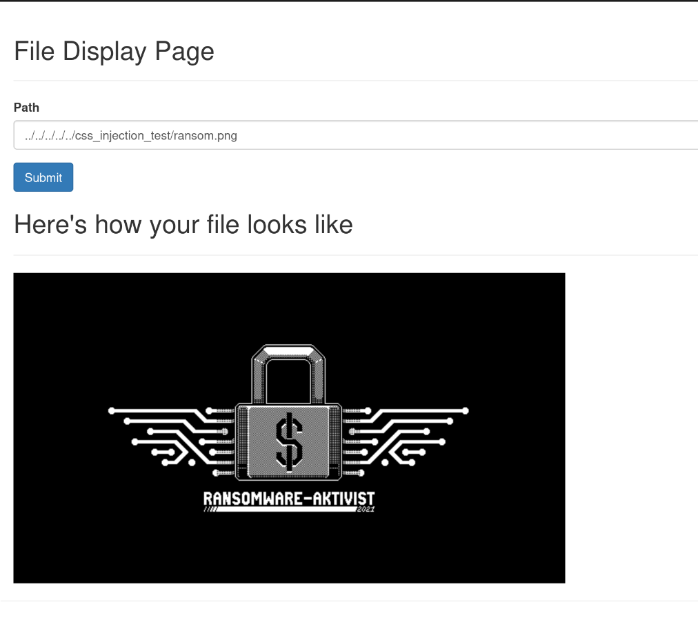

# Directory Traversal

The application fails to perform any validation before pulling files from the webserver and displays it on the frontend.

An attacker can exploit this vulnerability using multiple ../ path to go out of the webroot as seen below:



## Solution

As a best practice, ensure that the application finds file in your designated resources only and employ proper inut validation. In this case, we will be using the user supplied path to create a file, then take the parent folder and compare it with our designated folder. If it is wrong than we throw an exception.

```java
File file = new File(rootPath+File.separator+getPath());
if (!file.getParent().equals(new File(rootPath+File.separator).getAbsolutePath())) {
    throw new IOException(", not a file in allowed path");
}
```
