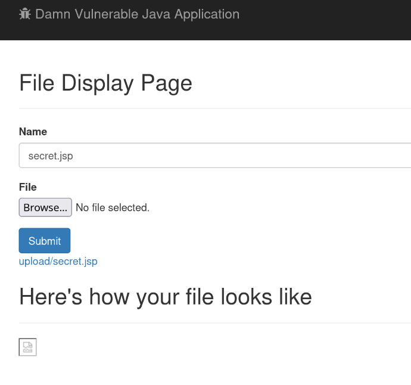
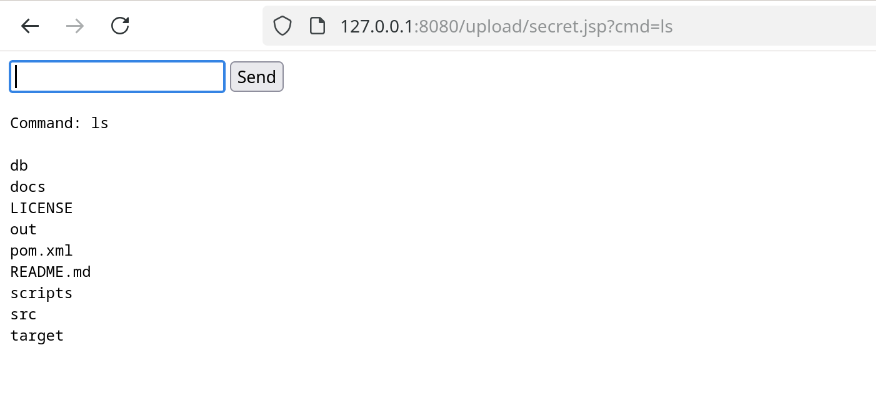

# Malicious File Upload

The application fails to perform any validation before uploading files to the webserver and displays it on the frontend as well as giving a link to the image.

An attacker can exploit this vulnerability to upload a malicious file, in this case a jsp webshell to gain control of the webserver:


_Fig 1: uploading the webshell_


_Fig 2: running ls on the webshell_

The attacker can also combine this vulnerability with the directory traversal vulnerability to overwrite system files or implant files for persistence.

## Solution

Following the best practice,we both check the extension and the mime type on the server's side, as well as not rely on user supplied metadata such as the content type header. In the codebase, we will be using apache Tika to do the magic bytes check.

```java
    public static String getContentType(byte[] fileBytes, String filenameWithExtension) throws IOException {
        TikaConfig config = TikaConfig.getDefaultConfig();
        Detector detector = config.getDetector();
        TikaInputStream stream = TikaInputStream.get(new ByteArrayInputStream(fileBytes));
        Metadata metadata = new Metadata();
        metadata.add(Metadata.RESOURCE_NAME_KEY, filenameWithExtension);
        return detector.detect(stream, metadata).toString();
    }
```

and FilenameUtils to check for filename extension.

```java
            if (!(FilenameUtils.getExtension(fileFileName).equals("jpg")
                    || FilenameUtils.getExtension(fileFileName).equals("jpeg")
                    || FilenameUtils.getExtension(fileFileName).equals("png")
                    || FilenameUtils.getExtension(fileFileName).equals("gif")
                    || FilenameUtils.getExtension(fileFileName).equals("bmp")
                    || FilenameUtils.getExtension(fileFileName).equals("webp"))
            ) {
                throw new IOException(", Invalid file extension");
            }
```
