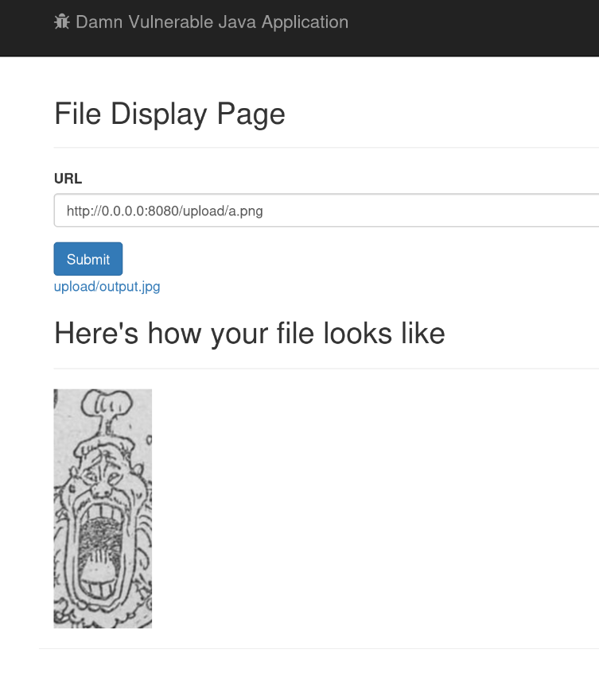

# WSTG-INPV-19 : Server Side Request Forgery

The application pull images from url, returns a link to the image and displays it. However, no input validation is put in place, so we abuse the fact to do SSRF by request local files using localhost.

We test for ssrf by requesting an image in the upload folder. As seen below, the server completed our request and displays it, confirming ssrf.



## Solution

To prevent ssrf, we will use a whitelist that only allows http and https, as well as filter all request with host from localhost, wildcard address and site local address. In the code base, the filter is as follows:

```java
                String host = url.getHost();
                InetAddress inetAddress = InetAddress.getByName(host);
                String protocol = url.getProtocol();
                if (!protocol.equals("https") && !protocol.equals("http")) {
                    return "Not Valid URL";
                }
                if (inetAddress.isLoopbackAddress() || inetAddress.isLinkLocalAddress()) {
                    return "Not Valid URL";

                }
                if (inetAddress.isAnyLocalAddress()) {
                    return "Not Valid URL";
                }
                if (inetAddress.isSiteLocalAddress()) {
                    return "Not Valid URL";
                }
            }
```
