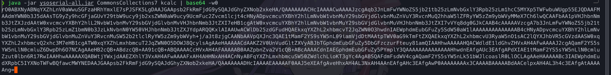
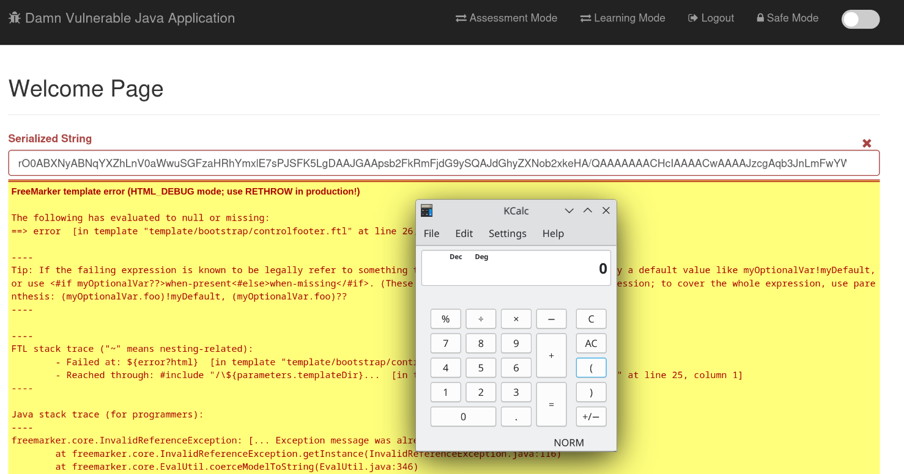

# Deserialization Vulnerability

The application takes an deserialised string and construct an object from it.To test the page, we first generate a payload deserialized string using ysoserial.


_Fig1: generating the payload from ysoserial_

The payload is then put into the input and a calc is pop from the process, proving the app is vulnerable to insecure deserialization.

_Fig2: executing the payload_

## Solution

To prevent insecure deserialization, we should upgrade java and the relevant libraries to the latest patch to prevent most gadget chains from triggering.If you desire more security then you can extend the base object input stream and put in a filter to only allow the whitelisted object. In the code base, the filter is as follows:

```java
            ByteArrayInputStream bytes = new ByteArrayInputStream(decoded);
            ObjectInputStream in =new WhitelistedObjectInputStream(bytes);
//WhitelistedObjectInputSteam class defined below
package com.appsecco.dvja.models;

import java.io.IOException;
import java.io.InputStream;
import java.io.ObjectInputStream;
import java.io.ObjectStreamClass;

public class WhitelistedObjectInputStream extends ObjectInputStream {
    public WhitelistedObjectInputStream(InputStream in) throws IOException {
        super(in);
    }

    @Override
    protected Class<?> resolveClass(ObjectStreamClass desc) throws IOException, ClassNotFoundException {
        // Get the class name before it's actually deserialized
        System.out.println("Deserializing class: " + desc.getName());
        if (!desc.getName().equals(User.class.getName())) {
            throw new ClassNotFoundException("Only User classes can be deserialized");
        }
        // Return the class normally
        return super.resolveClass(desc);
    }
}
```
